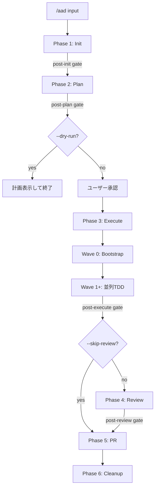

# AAD v2 — Agent Team Automation Plugin

Wave型並列実装の Claude Code Plugin。複数のAIエージェントが並列でTDD開発を行い、Git worktreeで安全に分離・マージする。

## 前バージョンからの主な改善点

| 改善 | 詳細 |
|------|------|
| **Plugin化** | `.claude-plugin/plugin.json` で公式Plugin形式に準拠 |
| **SKILL.md / command分離** | SKILL.md は概要のみ (常時ロード最小化)、オーケストレーターは commands/aad.md |
| **deps.sh による DRY化** | 依存インストールコード (~75行) を5箇所から1箇所に集約 |
| **タスク単位の状態管理** | state.json をWave単位→タスク単位に変更（部分再実行可能） |
| **Interface Contracts** | requirements.md にAPI契約テーブルを追加、Wave 0 で共有型ファイル生成 |
| **symlink対応** | worktree.sh に `setup-symlinks` を追加（node_modules/.venv等を共有） |
| **エージェント100行制限** | tdd-worker/reviewer を各100行以内に抑制 |
| **Review + PR** | Wave後レビューと最終レビューをオーケストレーターに統合 |
| **Codebase Investigation** | Plan Phase で3エージェント並列調査（構造・テスト・インターフェース）、計画精度向上 |

## ディレクトリ構成

```
aad-v2/
  .claude-plugin/plugin.json      # Plugin設定
  settings.local.json             # Agent Teams 有効化設定
  hooks/
    README.md                     # フック設定ガイド
    memory-check.sh               # Hook A: メモリ安全チェック
    worktree-boundary.sh          # Hook B: Worktree境界チェック
  skills/aad/
    SKILL.md                      # 概要・トリガー条件（常時ロード、~100行）
    references/
      subagent-prompt.md          # TDD Workerプロンプトテンプレート
      review-process.md           # Review Coordinatorプロセス定義
      investigation-guide.md      # コードベース調査エージェント指示（3エージェント定義）
    scripts/
      deps.sh                     # 依存関係インストール（DRY集約）
      worktree.sh                 # Git worktree管理（symlink対応）
      tdd.sh                      # TDDパイプライン（spinlock merge）
      plan.sh                     # 計画検証
      cleanup.sh                  # リソースクリーンアップ
      retry.sh                    # 汎用リトライラッパー（指数バックオフ対応）
      phase-gate.sh               # フェーズ間バリデーション
  commands/
    aad.md                        # メインオーケストレーター
  agents/
    aad-tdd-worker.md             # TDDワーカー（<100行）
    aad-planner.md                # Wave計画生成（調査機能付き）
    aad-reviewer.md               # 並列コードレビュー（<100行）
    aad-merge-resolver.md         # マージ競合解決（~65行）
```

## Phase 遷移フロー



## インストール

```bash
# Claude Code Plugin として配置
cp -r aad-v2/ ~/.claude/plugins/

# Agent Teams 機能を有効化（必須）
cp aad-v2/settings.local.json ~/.claude/settings.local.json
# 既存の settings.local.json がある場合は env セクションのみ追記してください
# 既存の settings.local.json とマージする場合
jq -s '.[0] * .[1]' ~/.claude/settings.local.json aad-v2/settings.local.json > /tmp/merged.json \
  && mv /tmp/merged.json ~/.claude/settings.local.json

# スクリプトを直接使う場合（プロジェクトに配置）
cp -r aad-v2/skills/aad/scripts/* path/to/project/scripts/
```

### tmux モード（オプション）

tmux がインストールされている環境では、teammate モードを tmux に変更するとターミナル分割で視覚的に確認できます:

```json
{
  "env": {
    "CLAUDE_CODE_EXPERIMENTAL_AGENT_TEAMS": "1"
  },
  "teammateMode": "tmux"
}
```

デフォルトの background モードは tmux 不要でほぼすべての環境で動作します。

### Hooks（オプション）

安全フックを有効化するには `hooks/README.md` の手順に従い `.claude/hooks.json` を設定してください:

```bash
# フックスクリプトを確認
cat ~/.claude/plugins/aad-v2/hooks/README.md
```

## 使い方

```bash
# 基本（カレントディレクトリのrequirements.mdを使用）
/aad requirements.md

# Kiro spec を使用
/aad .kiro/specs/auth-feature

# 別プロジェクトを指定
/aad ./my-project requirements.md

# オプション
/aad requirements.md --dry-run        # 計画のみ生成
/aad requirements.md --skip-review    # コードレビューをスキップ
/aad requirements.md --keep-worktrees # worktreeを保持
```

## 実行例

### 正常実行

```
$ /aad requirements.md

## Phase 1: 初期化完了
PROJECT_DIR: /Users/dev/my-app
PARENT_BRANCH: aad/develop
worktreeベース: /Users/dev/my-app-requirements-wt/
GATE PASS: post-init

## Phase 2: 計画生成完了
Wave数: 3 | エージェント数: 5
GATE PASS: post-plan

## Phase 3: Wave実行
### Wave 0: Bootstrap (逐次実行)
  ✓ コアモデル・共有型ファイル生成完了 (3コミット)

### Wave 1: 並列実行 (3エージェント)
  ✓ agent-order: TDD完了 → マージ成功
  ✓ agent-user: TDD完了 → マージ成功
  ✓ agent-notification: TDD完了 → マージ成功

### Wave 2: 並列実行 (2エージェント)
  ✓ agent-api: TDD完了 → マージ成功
  ✓ agent-cli: TDD完了 → マージ成功

GATE PASS: post-execute

## Phase 4: 最終コードレビュー完了
Critical: 0 | Warning: 2 | Info: 5 | 自動修正: 1件
GATE PASS: post-review

## Phase 5: PR作成
PR #42: https://github.com/user/my-app/pull/42

## Phase 6: クリーンアップ完了
✓ worktree削除・state.jsonアーカイブ
```

### ドライラン（計画のみ）

```
$ /aad requirements.md --dry-run

## Phase 1: 初期化完了
## Phase 2: 計画生成完了
Wave数: 3 | エージェント数: 5

DRY_RUN=true: 計画のみ生成しました。実行はされません。
計画ファイル: .claude/aad/plan.json
```

### エラー時

```
$ /aad requirements.md

## Phase 3: Wave実行
### Wave 1: 並列実行 (3エージェント)
  ✓ agent-order: TDD完了 → マージ成功
  ✗ agent-user: テスト失敗 → リトライ中...
  ✗ agent-user: リトライ後も失敗 → スキップして継続
  ✓ agent-notification: TDD完了 → マージ成功

⚠ Wave 1: 失敗タスク 1件 (agent-user)
⚠ Wave 2: agent-api を依存失敗のためスキップ

GATE FAIL: 失敗タスクが 1 件あります

## Phase 4: 最終コードレビュー完了
Critical: 1 | Warning: 3 | Info: 2 | 自動修正: 0件
⚠ post-review ゲート失敗: critical issues が検出されました。--skip-review で回避可能です。
```

## 環境変数

| 変数 | 説明 |
|------|------|
| `AAD_SKIP_REVIEW=true` | コードレビューをスキップ |
| `AAD_STRICT_TDD=true` | TDDサイクル未遵守をエラー扱い |
| `AAD_WORKERS=N` | 最大並列数（デフォルト: 3） |
| `AAD_SCRIPTS_DIR` | スクリプトディレクトリの明示指定 |
| `AAD_HOOK_DEBUG=1` | フックの詳細ログを有効化（`set -x`） |

## 状態管理（3層ハイブリッド）

| レイヤー | 役割 | 永続性 |
|---------|------|--------|
| `state.json` (タスク単位) | 失敗タスク特定・部分再実行 | ✓ セッション跨ぎ可 |
| Agent Teams TaskList | リアルタイム協調 | ✗ セッション内のみ |
| Git log | マージ済みコミット（権威ある記録） | ✓ 永続 |

### state.json 形式

```json
{
  "schemaVersion": 1,
  "runId": "20260218-143022",
  "currentLevel": 2,
  "completedLevels": [0, 1],
  "tasks": {
    "wave0-core": { "level": 0, "status": "completed", "completedAt": "..." },
    "agent-order": { "level": 1, "status": "completed", "mergedAt": "..." },
    "agent-portfolio": { "level": 1, "status": "failed", "reason": "test failures" }
  },
  "mergeLog": [
    { "agent": "agent-order", "mergedAt": "...", "branch": "feature/agent-order" }
  ]
}
```

詳細なスキーマ定義は [`specs/state.schema.md`](specs/state.schema.md) を参照。

## Codebase Investigation（既存プロジェクト向け）

Plan Phase で既存コードベースを自動調査し、計画精度を向上させます（ファイル数 ≥ 10 の場合）。

### 3 並列調査エージェント

| エージェント | 調査内容 | 出力ファイル |
|------------|---------|------------|
| `investigator-structure` | ディレクトリ構造・アーキテクチャパターン・主要モジュール | `.claude/aad/investigation/structure.md` |
| `investigator-tests` | テストフレームワーク・カバレッジ・テストパターン | `.claude/aad/investigation/tests.md` |
| `investigator-interfaces` | API エンドポイント・型定義・モジュール依存グラフ | `.claude/aad/investigation/interfaces.md` |

### 効果

- 既存のアーキテクチャパターンを踏襲した実装計画を生成
- 既存インターフェースの破壊的変更を防止
- 既存テストパターンに合わせたテストケース設計
- モジュール間依存関係に基づいた最適な Wave 割当

## Interface Contracts

requirements.md にテーブル形式で定義（JSON スキーマ不要）:

```markdown
## Interface Contracts

### API Endpoints
| Method | Path | Request | Response | Notes |
|--------|------|---------|----------|-------|
| POST | /api/orders | { symbol, qty } | Order | 新規作成 |
| PATCH | /api/orders/:id | { qty?, status? } | Order | 部分更新 |

### Shared Types
- Order: { id: number, symbol: string, quantity: number, status: "active"|"filled" }
```

Wave 0 でこの定義から共有型ファイル（`src/types/api.ts` 等）を生成する。

## トラブルシューティング

### よくあるエラーと対処法

#### 1. `GATE FAIL: state.json に schemaVersion がありません`

**原因**: v0 形式の state.json（旧バージョン）が残っている。

**対処**: 新規 run を開始するか、state.json を手動修正:
```bash
# state.json に schemaVersion を追加
jq '. + {"schemaVersion": 1}' .claude/aad/state.json > /tmp/state.tmp \
  && mv /tmp/state.tmp .claude/aad/state.json
```

#### 2. `GATE FAIL: マージロックが残存しています`

**原因**: 前回の実行が途中で中断され、`aad-merge.lock` が残った。

**対処**:
```bash
rm .claude/aad/aad-merge.lock
```

#### 3. `GATE FAIL: 失敗タスクが N 件あります`

**原因**: Wave 実行中にエージェントがテスト失敗した。

**対処**: 部分再実行（復旧フロー）:
```bash
# 失敗タスクを確認
jq '.tasks | to_entries[] | select(.value.status == "failed")' .claude/aad/state.json

# 失敗タスクのみ再実行（状態をリセット）
jq '.tasks["agent-xxx"].status = "pending"' .claude/aad/state.json \
  > /tmp/state.tmp && mv /tmp/state.tmp .claude/aad/state.json

# /aad を再実行（完了済みレベルはスキップされる）
/aad requirements.md
```

#### 4. `deps.sh が見つかりません` 警告

**原因**: `CLAUDE_PLUGIN_ROOT` が未設定、またはプラグインが正しくインストールされていない。

**対処**:
```bash
# 環境変数を明示指定
export AAD_SCRIPTS_DIR="$HOME/.claude/plugins/aad-v2/skills/aad/scripts"
/aad requirements.md
```

#### 5. worktree 操作エラー (`already exists`)

**原因**: 前回の worktree が削除されずに残っている。

**対処**:
```bash
# 孤立 worktree の削除
git worktree prune
ls ../myproject-requirements-wt/ && rm -rf ../myproject-requirements-wt/
```

### 復旧フロー（部分再実行）

```bash
# 1. 現在の状態を確認
cat .claude/aad/state.json | jq '{currentLevel, completedLevels, failed: [.tasks | to_entries[] | select(.value.status == "failed") | .key]}'

# 2. 完了済みレベルを保持したまま失敗タスクをリセット
# （/aad コマンドが自動的に completedLevels をスキップする）

# 3. 再実行
/aad requirements.md
```
